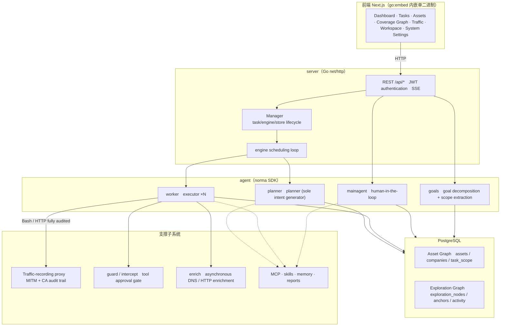
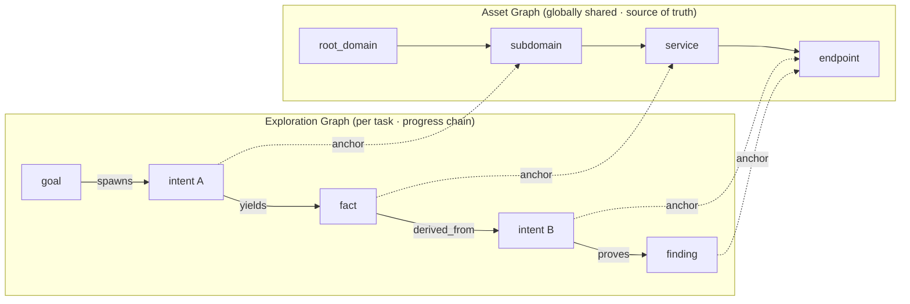
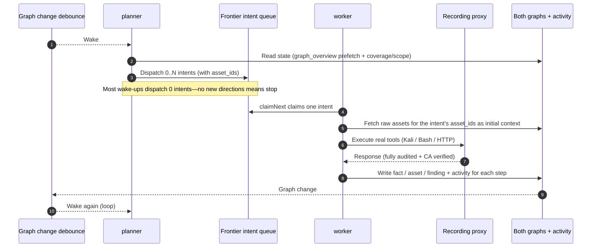
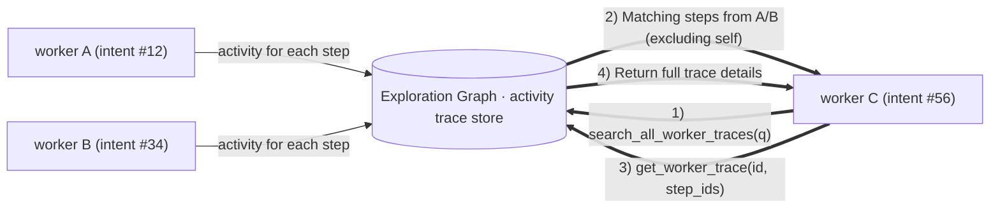
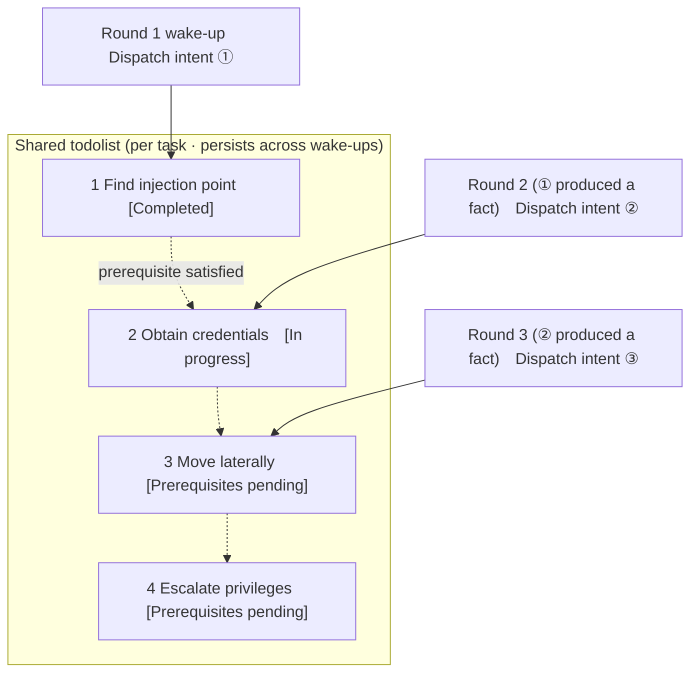

<div align="center">

# ARTEX

AI-powered autonomous penetration testing system (Go backend + Next.js frontend)


🌐 **在线 Demo**： [https://artex-demo.vercel.app/](https://artex-demo.vercel.app/)

</div>

---

## Screenshots

> See the [online demo](https://artex-demo.vercel.app/) for the full interactive experience.

| Dashboard (overview / token usage / activity stream) | Task list |
| :---: | :---: |
|  |  |

| Task · Execution (sessions / tool calls) | Exploration graph |
| :---: | :---: |
|  |  |

| Findings | Assets |
| :---: | :---: |
|  |  |

| Asset coverage graph (force-directed layout · tested assets highlighted · nodes expandable/collapsible) |
| :---: |
|  |

| Traffic recording | Human-in-the-loop chat |
| :---: | :---: |
|  |  |

| Agent management | LLM configuration |
| :---: | :---: |
|  |  |

| Interception approvals | Backend logs |
| :---: | :---: |
|  |  |


---

## Approval Record Details

Global "Approval Records", task-level "Interception Approvals", and approval cards in chat can all be expanded to show details. The layout is based on
[AegisHook's approval details component](https://github.com/RuoJi6/AegisHook/blob/main/web/src/components/CallDetail.vue), using ARTEX's existing components and theme:


## Asset Synchronization (ScopeSentry)

Assets can be synchronized directly from [ScopeSentry](https://github.com/Autumn-27/ScopeSentry), avoiding duplicate collection:

- Enter the ScopeSentry address and API Key on the **Asset Sync** page to connect the data source.
- Select targets and asset types (domain / subdomain / IP / port / site / endpoint…) by **project** or **task**.
- Import with one click and group assets by company scope. They are added directly to ARTEX's asset graph for agents to explore.

---

## Installation

> Requires a **PostgreSQL** database. Exploration requires an **LLM** (`ANTHROPIC_API_KEY` or `OPENAI_API_KEY`; these can also be configured in the UI).

### Option 1: One-line Install Script (Recommended)

```bash
git clone https://github.com/Autumn-27/ARTEX.git
cd ARTEX
./install.sh
```

The script detects and installs Docker if needed, then prompts you to choose **① Docker for everything** or **② build and run locally**:

- **① Docker for everything**: Enter a Postgres password (or press Enter to generate one) → write `.env` automatically → `docker compose up -d`.
- **② Run locally**: Choose a database (use an existing one or start one with Docker) → generate `config.json` → compile a single binary with the frontend embedded using `go` → start.

After installation, open **http://localhost:8787** (visit `/setup` on first launch to set the administrator password).

### Option 2: Docker Compose (Manual)

```bash
git clone https://github.com/Autumn-27/ARTEX.git
cd ARTEX
cp .env.example .env          # Set POSTGRES_PASSWORD and optionally ANTHROPIC_API_KEY
docker compose up -d          # Pull the autumn27/artex and postgres images
# → http://localhost:8787
```

The image includes common tools (ripgrep/curl/vim/npm/nmap…). `./skills` and `./data` are persisted using bind mounts.

For remote MCP, select `http` (Streamable HTTP) or `sse` (legacy SSE) in system settings.
Legacy SSE services usually establish an event stream with `GET /sse`, then receive JSON-RPC requests through the returned
`/message?sessionId=...` 接收 JSON-RPC 请求；配置时将 URL 填为 `/sse`，请求头按
`Authorization=Bearer <token>` 填写。

### Option 3: Download a Prebuilt Binary (Releases)

Download the platform-specific zip from [Releases](https://github.com/Autumn-27/ARTEX/releases). Extract it to get `artex` + `start.sh` (`start.bat` on Windows) + `skills/` + `config.example.json`:

```bash
cp config.example.json config.json   # 填好 database 连接
./start.sh                           # → http://localhost:8787
```

> Start with `start.sh` / `start.bat` rather than running `./artex` directly. These are supervisor scripts: when the program exits, they use its exit code to decide whether to restart it. **The [one-click update](#option-1-one-click-update-recommended) in the UI relies on them to replace the binary.** If you run `./artex` directly, it will not be restarted after an update.
> To keep it running in the background: `nohup ./start.sh >artex.log 2>&1 &`.

### Option 4: Build a Single Binary from Source

```bash
# 1) Export the frontend as static files
cd web && npm ci && npm run build:static && cd ..
# 2) Copy files into the embedded assets directory
cp -r web/out server/webui/dist
# 3) Build (the frontend is embedded only with -tags embedui)
CGO_ENABLED=0 go build -tags embedui -o artex ./cmd/artex
./start.sh
```

### Option 5: Build Cross-Platform Release Archives

`build.sh` builds and embeds the frontend, strips debug information with the Go linker, and packages the release files into zip archives. Release mode builds zip packages for Linux amd64/arm64, macOS amd64/arm64, and Windows amd64 by default:

```bash
./build.sh --release
# Artifacts: dist/artex-0.3.3-*.zip
```

UPX self-extracting binaries may be incompatible with some Linux kernels, virtualization environments, or security policies, so UPX is disabled by default. Use `ARTEX_TARGETS` to customize targets. If the target environment is compatible, pass `--upx` to further reduce binary size:

```bash
ARTEX_TARGETS=linux/amd64,windows/amd64 ./build.sh --release
./build.sh --target linux/amd64 --upx
```

---

## Updating

> Updates replace only the program; data is preserved: the Postgres volume `pgdata`, `./data` (jwt.key / SQLite, etc.), and `./skills` are retained. **Database migrations do not need to be run manually**—on every startup, `artex` idempotently reapplies `schema.sql` (including `ADD COLUMN` / `CREATE INDEX IF NOT EXISTS`), so restarting performs migrations. We still recommend backing up `./data` and the database before updating.

### Option 1: One-Click Update in the UI (Recommended)

Check for and install new versions from the **Version and Updates** card on the **System Settings** page (sidebar **System Settings** → `/system/settings`), without logging in to the server.

After clicking **Update**: the platform-specific release package is downloaded → checked against the Release `SHA256SUMS` → the new binary is smoke-tested with `-h` → staged as `artex.new` → the program exits and `start.sh` / `start.bat` relaunches it and completes the replacement. The page waits for the new version to start, then refreshes automatically.

- **A failed update will not leave a broken binary behind**: if validation or the smoke test fails, the staged binary is discarded and the current version keeps running. If the new version fails to start three times in a row, it rolls back to `artex.old` (the failed binary is kept as `artex.failed` for troubleshooting).
- **Rollback is always available**: the previous version is kept as `artex.old`, with a **Roll back to previous version** button on the card. Note that database schema changes are not rolled back.
- **Updates interrupt running tasks**—an update restarts the program, so do it while idle.
- **Development builds cannot be updated**: updates are disabled if the version is `dev` or `git describe` includes a suffix, preventing a release from overwriting a local development binary.
- **In Docker, only the program is replaced, not the image**: tools such as Playwright and nmap in the image are not upgraded, and rebuilding the container with `docker compose up -d` reverts to the image's version. To upgrade the image too, use `docker compose pull artex && docker compose up -d artex`.
- If GitHub access requires a proxy, configure the **global proxy** on the same page; the update process will use it. Updates download only from GitHub domains and require HTTPS.

### Option 2: One-Click Update Script

```bash
cd ARTEX
./update.sh
```

The script optionally runs `git pull` to fetch the latest code, then prompts you to choose **① update with Docker** or **② build and update locally** (corresponding to `install.sh`):

- **① Docker**: Optionally specify the image tag (press Enter to use `ARTEX_TAG` from `.env`, defaulting to `latest`) → `docker compose pull` → `docker compose up -d` (restarting with the new image automatically runs migrations).
- **② Local**: Rebuild the frontend static assets → recompile `./artex` (restart the process to apply).

### Option 3: Docker Compose (Manual)

```bash
cd ARTEX
git pull                       # Update compose / scripts (optional)
# Set ARTEX_TAG=v0.2.0 in .env to pin a version; defaults to latest
docker compose pull artex
docker compose up -d artex     # 换新镜像重启 → 自动迁移 schema
docker image prune -f          # Remove old images (optional)
```

### Option 4: Prebuilt Binary (Releases)

Download the new version's zip from [Releases](https://github.com/Autumn-27/ARTEX/releases). Stop the old process, replace `artex` and `skills/` (keep your `config.json` and `data/`), then restart:

```bash
cp -r <解压目录>/skills ./ && cp <解压目录>/artex ./
./start.sh
```

### Option 5: Build from Source

```bash
git pull
cd web && npm ci && npm run build:static && cd ..
cp -r web/out server/webui/dist
CGO_ENABLED=0 go build -tags embedui -o artex ./cmd/artex
# Restart ./start.sh
```

---

## Configuration

**Database** (`config.json`, or override with the `ARTEX_PG_DSN` environment variable):

```json
{
  "database": {
    "host": "127.0.0.1", "port": 5432,
    "user": "artex", "password": "yourpass",
    "dbname": "artex", "sslmode": "disable"
  }
}
```

**LLM**: `export ANTHROPIC_API_KEY=sk-...` (or `OPENAI_API_KEY`), or enter it on the **LLM Configuration** page in the UI.
Optional: `ARTEX_LLM_PROVIDER` / `ARTEX_LLM_MODEL` / `ARTEX_LLM_BASE_URL` / `ARTEX_LLM_PROXY`.

**Concurrency**: Configure the number of work agents per task in **System Settings** (default: 3).

**Common arguments**: `./start.sh -addr :8787 -proxy :8788` (`-addr` serves the frontend and API; `-proxy` is the traffic-recording proxy). The startup script passes the arguments through to `artex` unchanged.

### Reverse Proxy Deployment (HTTPS / Port 443 Only)

The frontend and API/SSE are served by the same backend port (default `:8787`). The live activity stream uses the **same origin** by default, so **`NEXT_PUBLIC_SSE_BASE` does not need to be configured**. Expose only port 443 publicly and keep 8787 on the internal network.

SSE uses a long-lived connection with continuous updates, so the reverse proxy **must disable buffering**. Otherwise, the browser can connect but will not receive events (the activity stream will keep spinning). Nginx example:

```nginx
server {
    listen 443 ssl;
    server_name your.domain.com;
    # ssl_certificate / ssl_certificate_key ...

    location / {
        proxy_pass http://127.0.0.1:8787;
        proxy_set_header Host $host;
        proxy_set_header X-Forwarded-Proto $scheme;

        # SSE essentials: disable buffering, use a long timeout, and HTTP/1.1
        proxy_buffering off;
        proxy_cache off;
        proxy_read_timeout 3600s;
        proxy_http_version 1.1;
        proxy_set_header Connection "";
    }
}
```

> Set `NEXT_PUBLIC_SSE_BASE` at **build time** only if SSE must use a different origin from the page (for example, a separate subdomain). The variable is baked into the static bundle during `next build`, so setting it at container runtime has no effect.

---


## Development

### Manual Finding Retests

The **Retests** tab in task details lets you select findings from the task with pagination, review previous conclusions and evidence, and start a retest manually. The current tab stays open after launch, with a spinner and **Retesting** indicator; confirmed fixes update the finding status.

Click **Retest** in a finding row's actions, or **Start Retest** in the **Finding Retest** section of finding details. Optionally provide a fixed version, test conditions, or restrictions. The system creates a separate retest Agent session and keeps the current page open. The entry point is available in the flat, task-grouped, and asset views. While a retest runs, a spinner and **Retesting** indicator appear; click to open the corresponding session, and **Retest** returns when it finishes. Retesting does not require restarting the original scan. Conclusions are **Still Reproducible**, **Fixed**, or **Unable to Confirm**; each conclusion, its evidence, and a link to the session are saved in finding details.

On first startup, the new backend provisions an editable **Finding Retest** (`retester`) Agent. Configure its prompt, LLM, run budget, and tools in Agent Management. It uses its bound LLM by default, or the globally active configuration if none is bound. When a retest session completes successfully with a **Fixed** conclusion, the finding status is automatically changed to **Fixed**; while running, or on failure, stop, or any other conclusion, its status is unchanged. Original evidence and reports are always retained. You can also select **Fixed** manually from the status dropdown. If a finding is already being retested, the existing session is reused. A new retest can be started after it is stopped, fails, or the service restarts.

In this release, history is available through finding details and sessions, but is not yet included in finding report exports or task archives and is not automatically linked to traffic captures. Demo mode creates clearly labeled simulated records only; it does not send requests to real targets.

### Run Locally and Test

```bash
./dev.sh    # Backend (:8787) + traffic proxy (:8788) + frontend next dev (:5173) → http://localhost:5173
```

- Backend: `go run ./cmd/artex` (without `-tags embedui`, the frontend is not embedded)
- Frontend: `cd web && npm run dev` (`/api` is proxied to the backend, with hot reload)
- Tests: `go test ./...`
- Mock preview (without the backend): `cd web && NEXT_PUBLIC_MOCK=1 npm run dev`

---

## System Architecture

ARTEX is an **LLM-powered multi-agent autonomous penetration testing system**: a Go monolithic backend (with the Next.js frontend embedded) + PostgreSQL. Agent capabilities are provided by the [`norma`](https://github.com/Autumn-27/norma) SDK (`agentcore` / `tool` / `permission` / `harness` / `memory` / `transcript`). Its core is a **dual-graph architecture**, supported by two autonomy mechanisms: **process-level information sharing between workers** and a **planner that shares a todolist across rounds to keep attack chains on track**.

### High-Level Architecture



| Layer | Responsibilities |
| --- | --- |
| **Frontend** | Next.js static export embedded in the single binary with `go:embed`; visualizes tasks/assets/exploration graph/coverage graph and human-in-the-loop chat |
| **server** | `net/http` routes + JWT authentication + SSE; `Manager` owns the lifecycle of tasks, engine, and DB store |
| **engine** | One `plannerLoop` + N worker goroutines per task; intent claiming, timeout/pause/drain |
| **agent** | goals / planner / worker / mainagent; `ToolSet` exposes both graphs as LLM tools |
| **db** | PostgreSQL implementation of both graphs (pgx); schema is idempotently created on startup via `go:embed` |
| **Supporting systems** | Recording MITM proxy, approval gate, asynchronous enrichment, MCP/skills/memory/reports |

### Dual-Graph Architecture: Exploration Graph + Asset Graph

The system separates **"what is the objective?"** from **"what has been tested, and how thoroughly?"** into two independent graphs linked by anchors:

- **Asset Graph (globally shared)**: a cross-task source of truth for assets. Nodes include `root_domain / subdomain / ip / service / app / endpoint` and belong to companies. The program computes parent-child relationships (domain → subdomain → service → endpoint) and deduplication keys; agents submit only raw information.
- **Exploration Graph (one per task)**: the task's process of reasoning and progress. Nodes include `goal / intent / fact / finding / hint`, connected by edges such as `spawns / derived_from / yields / proves` into a **lineage chain** that answers "which facts led to this direction, and what did it produce?"
- **The graphs are linked by anchors**: `exploration_anchors(node_id, asset_id)` anchors intents/facts/findings to specific assets. This lets you see which assets an exploration direction covered, or which intents tested an asset and what facts they found. It also powers **asset test coverage** and the **asset coverage graph** (in-scope assets with tested assets highlighted).



> Responsibilities: the **planner** reads the exploration graph, evaluates objectives, and adds **intents** to the frontier only for new, uncovered directions. A **worker** claims **one intent**, executes it with real tools, writes new assets/facts/findings to both graphs, and stops. The asset graph is shared truth; the exploration graph tracks progress per task.

### Engine and Intent Lifecycle (One Exploration Cycle)

The engine is an **event-driven** loop: a graph change wakes the planner, which dispatches intents; workers claim and execute them, then write results back to trigger the next round—until the objective is proven (`prove_goal`).



### Process-Level Information Sharing Between Workers

During an in-depth exploration, useful observations (an error, a response, a hidden parameter) may appear in a worker's **execution trace** without being recorded as a formal fact. To avoid duplicated effort and let workers build on one another's work, workers can **search traces across work items**:

- `search_all_worker_traces(q)`: search by keyword in **other work traces in this task** (steps from the current intent are automatically excluded); matches include `intent_id`.
- `list_worker_traces` / `get_worker_trace(intent_id, step_ids=[…])`: list completed work items, then retrieve full details for selected steps to share observations.

This lets subsequent workers reuse observations from other traces even when no corresponding fact has been added to the exploration graph. **Information flows between workers at the execution-trace level**, while boundaries remain unchanged: each worker still handles only its claimed intent.



### Planner Shares a Todolist Across Rounds → Stable Attack Chains

Real attack chains are often **multi-step sequences with dependencies** (for example: find an injection point → obtain credentials → move laterally → escalate privileges). Dispatching all steps in parallel would be chaotic, so the planner maintains a **task-scoped planning todolist shared across wake-ups**:

- The planner is event-driven: graph changes wake it, but **each wake-up starts a fresh session**. The shared todolist lets it **record a sequential exploitation chain once**, then **dispatch intents step by step according to dependencies** across subsequent rounds instead of expanding the whole chain in advance.
- Each round dispatches only the next step whose prerequisites are complete and whose dependent facts exist, updating the list as facts satisfy steps.



This keeps attack chains **progressing reliably, without duplication or reordering** even in an event-driven, stateless-session environment—a key part of ARTEX's ability to autonomously complete multi-step exploitation chains.

---

## Community

Scan the QR code to follow the **SecSentry** WeChat Official Account, then send a direct message to join the community.

<div align="center">


</div>

---
## References

https://github.com/oritera/Cairn


## License and Disclaimer

### Open-Source License

This project is licensed under the **GNU Affero General Public License v3.0 (AGPL-3.0)**. See the [LICENSE](LICENSE) file in the repository root for the full terms.

This means anyone may use, modify, and distribute the project, but **derivative works must also be open-sourced under AGPL-3.0**. In particular, **if you modify the project and make it available to users over a network (for example, as an online service), you must also make the complete corresponding source code available to those users**.

> ⚠️ **Important**: The open-source license itself does not restrict how the software may be used. The following **Usage Restrictions** and **Disclaimer** are additional terms and formal notices from the authors to users. Please observe them.

**ARTEX is for personal learning, code study, and local technical validation only. It must not be used to conduct real-world testing against any online system or website.**

### Permitted Uses

- Use is limited to **reading, learning about, and studying this project's source code**, and validating technical principles in a **locally isolated environment**.
- Permitted non-offensive uses include personal learning, academic research, and code review.

### Prohibited Uses

- **Do not use this tool to scan, probe, exploit, or attack any website, online service, or networked system** (regardless of authorization or ownership).
- Do not use this tool for real-world penetration testing, offensive or defensive operations, or in production environments.
- Do not use this tool for unauthorized access, data theft, extortion, denial of service, or any destructive or criminal activity.
- Do not use this tool in violation of the laws or regulations of your country or region.

### Compliance Responsibility

Users are responsible for complying with all cybersecurity, data protection, and computer-crime laws and regulations in their country or region (in mainland China, including but not limited to the Cybersecurity Law, Data Security Law, Personal Information Protection Law, and related judicial interpretations). **Users bear all legal liability and consequences arising from their use of this tool.**

### Disclaimer

This project is provided "AS IS", without warranties of any kind, express or implied. The authors and contributors are not liable for any direct or indirect loss, data loss, system damage, or legal disputes resulting from use of this tool, regardless of whether it is used appropriately. **By downloading, installing, or using this project, you acknowledge that you have read, understood, and agreed to all the terms above.**
