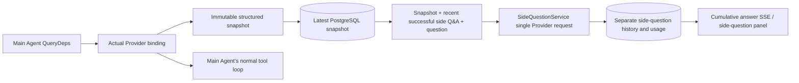

# ARTEX `/btw`

Regular chat, a task's MainAgent, and its own Workers support independent side questions. Enter `/btw question` in the main input to submit one; enter `/btw` with no question or click **Side Question** to open history. Desktop uses a resizable sidebar; mobile uses a Drawer.

Side-question answers are generated from a snapshot of the Agent context at submission time, with streaming, follow-up questions, stop, and clear controls. Closing the panel, refreshing the page, or disconnecting SSE does not cancel the model request. Stop affects only the current side question; Clear cancels side questions and deletes their history while retaining the main context snapshot.

## Implementation Scope

Uses Go, norma v0.3.7, Next.js, and the existing Markdown / ResizablePanel / Drawer / AlertDialog components. No norma source code was modified and no dependencies were added for side questions. Planner, Workers inherited from other tasks, and upgrades to tool-based subtasks are out of scope.

- `capture.go` marks main-loop requests only at `Options.Deps.CallModel / CallModelSync`. The Provider decorator is inside the concrete model and runs after outer routing-pool selection, so it records the model actually selected; compaction and summarization requests do not overwrite the snapshot.
- Snapshots are published when a request starts, after a complete model response, and at a terminal run state. Partial responses still being generated are not published. Tool calls remain paired through norma's `MessagesForAPI`; tool results enter the snapshot on the next main-model request or at a terminal run state. If streaming is interrupted, the last valid boundary is retained.
- Snapshots use a JSON deep copy to preserve structured messages, system prompts, tool definitions, and generation parameters. Model inference does not hold the snapshot lock or a database transaction.
- `SideQuestionService` calls the concrete Provider. If needed, it first generates a side-question summary. The final answer may be reduced and retried once only if the initial request exceeds the context window before producing text or tool calls. No agent session is created, and side questions do not connect to the tool executor, main transcript, activity stream, or task graph, nor pass through the task model-switching chain. Tool definitions are retained in answers for compatibility with existing structured tool context; summary requests have no tools. Newly returned tool calls have no execution path.
- Each parent conversation can have one running request; a service process allows at most four, with a 120-second timeout per request. Side questions use an independent cancellation context tied to the service lifecycle.
- Side-question requests retain the model configuration reference and a non-sensitive identity summary; credentials are obtained from the existing configuration at request time. If the configuration is deleted or identity fields such as model, protocol, or address change, run the main Agent first to update the snapshot. Tests do not change the product's default model.

## Persistence and Recovery

`db/schema.sql` automatically creates `side_question_sessions` and `side_question_requests`. The former stores the parent resource, latest snapshot, run ID, version, and cleanup version; the latter stores questions, cumulative answers, status, model, snapshot time, usage, event sequence number, and pagination ordinal.

The parent conversation key uses the conversation ID, or task ID + exploration ID + intent ID. Workers are not named after reusable execution slots.

Snapshots are coalesced per parent conversation and flushed every 250 ms. The database compares `(run_id, version)` to prevent older versions from overwriting newer ones. The selected snapshot is saved again before a side question is admitted. After a successful save, the large in-memory snapshot is released; on failure, the pending version is retained for writing. Cumulative answers are written at most every 250 ms as streaming events arrive; terminal states are saved immediately, with a limited retry on database errors.

At startup, leftover `running` requests are marked `interrupted`. Any partial answer and usage already written to the database are retained, and requests are not replayed automatically. The most recently saved context can be used for the next question. If an older conversation has no snapshot, run the main Agent first; context is not reconstructed from UI activity records.

Clear increments the cleanup version and deletes requests; conditional updates prevent late callbacks from writing them back. Physical parent-resource deletion relies on foreign-key cascades. Logical Worker deletion removes side-question data in the same transaction and rejects later snapshots. Task archiving first blocks new requests, waits for the main flow to stop, cancels side questions, and waits for their data to be persisted. Archive format v3 is used, with compatibility for v1/v2 archives that lack side-question tables.

History is fully retained and returned in pages of up to 20 items using an ordinal cursor. Model requests replay at most the 20 most recent successful Q&A pairs verbatim, subject to the token budget; older Q&A is maintained in a separate rolling summary. If the main context exceeds budget, only older portions of the side-question copy are summarized, preserving recent structured tool calls and results. Summarization, preparation progress, and usage are all subject to side-question concurrency, cancellation, and the 120-second timeout. See [Context Budget and Open-Source References](CONTEXT_BUDGET.md).

## HTTP Contract

The following paths serve as `{parent}` and use existing authentication and resource validation:

- `/api/conversations/{id}`
- `/api/tasks/{id}/chat`
- `/api/tasks/{id}/intents/{iid}`

| Request | Response and behavior |
| --- | --- |
| `GET {parent}/side-questions?before={ordinal}` | `items` ordered newest to oldest; independent `current` running state; `snapshot` metadata; `next_cursor`; cursor 0 means the latest page / no next page |
| `POST {parent}/side-questions` | JSON `{ "question": "…", "client_request_id": "UUID" }`; a new request returns 202 and the request object; the same ID and question return the existing object with 200 |
| `DELETE {parent}/side-questions` | Cancel and clear side-question history for the current parent conversation |
| `GET /api/side-questions/{requestID}/events` | `snapshot` SSE event; `id` is an increasing sequence number and `data` is the full cumulative request object; sends `cleared` when history is cleared |
| `POST /api/side-questions/{requestID}/cancel` | Explicit cancellation; the terminal state can be read from history or SSE |

Questions are limited to 4000 characters. Missing snapshots, changed model configuration, a busy parent conversation, or an idempotency ID conflict return 409; reaching the global concurrency limit returns 429. Every SSE connection first sends cumulative state and does not depend on text chunks previously received by the client. The frontend merges by request ID + sequence number and discards stale callbacks when switching parent conversations or clearing history.

## Validation and References

See [VALIDATION.md](VALIDATION.md) for automated checks, real model usage, and known limitations.

For independent requests, see [Grok CLI side-question.ts (pinned commit)](https://github.com/superagent-ai/grok-cli/blob/fb97af83f06dca873281d60168430f06c8de6324/src/utils/side-question.ts); for runtime isolation, see [OpenCode (pinned commit)](https://github.com/anomalyco/opencode/tree/b3f1a96c6dd7adeb28b36dd11add1998fc84d67b). ARTEX uses norma's structured messages for context rather than concatenating text from frontend logs.
