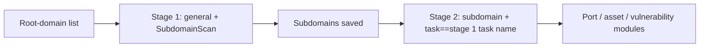

---

## name: scopesentry-mcp
description: Manage the ScopeSentry security scanning platform (projects, tasks, templates, assets, and nodes) through MCP. Use when the user mentions ScopeSentry, MCP, API Keys, scan tasks, or asset queries.

# ScopeSentry MCP Guide

For users of an **already deployed ScopeSentry instance**. Connect to the platform through Cursor (or another MCP client); no local source code is needed.

## 1. Prerequisites

### 1.1 Verify Service Access

- Default web interface: `http://<host>`
- MCP endpoint: `http://<host>/mcp` (if there is a reverse proxy or frontend proxy, use the actual `/mcp` address)

### 1.2 Create an API Key

1. Sign in to the ScopeSentry web interface in a browser.
2. Open the **API Key** management page and create a key (or create one through an endpoint provided by your administrator).
3. Save the returned `ssk_...` string (**it is shown only once**).

### 1.3 Configure Cursor MCP

Cursor → Settings → MCP → Add Server:

```json
{
  "mcpServers": {
    "scopesentry": {
      "url": "http://<your-host>:8082/mcp",
      "headers": {
        "X-API-Key": "ssk_your-key"
      }
    }
  }
}
```

Alternatively, use: `Authorization: Bearer ssk_你的密钥`

After configuring, restart MCP or reload Cursor and confirm that tools such as `list_projects` and `list_assets` appear in the tool list.

---

## 2. Available Tools


| Tool                     | Purpose                |
| ---------------------- | ----------------- |
| `list_projects`        | Project tree grouped by tags (includes project IDs) |
| `list_projects_data`   | Paginated project list, searchable by name |
| `get_project`          | Project details |
| `create_project`       | Create a project |
| `list_tasks`           | Scan task list |
| `get_task`             | Task details |
| `list_scan_templates`  | Scan template list |
| `get_scan_template`    | Template details |
| `list_plugin_modules`  | Scan pipeline module names |
| `list_plugins`         | Available plugins (including hash and default parameters) |
| `create_scan_template` | Create a scan template |
| `create_scan_task`     | Create a scan task |
| `list_assets`          | Query asset types (paginated list) |
| `count_assets`         | Count assets (`/api/assets/common/total`) |
| `get_asset_detail`     | Asset or finding details |
| `add_asset_tag`        | Add a tag to an asset |
| `list_nodes`           | Scan node list |


Refer to each MCP tool description (schema) for its parameters. `list_assets` and `count_assets` use the same `search` and `filter` syntax; read the `list_assets` description before querying assets.

Use `count_assets` to get the total number of results (it corresponds to the web pagination count endpoint); there is no need to page through `list_assets` repeatedly just to count them.

---

## 3. Common Workflows

### 3.1 Query Assets by Project

When the user or context **already specifies a project**, include `filter.project` to narrow the scope and avoid slow responses from querying too much cross-project data. If there is no explicit project context, the project filter is optional.

1. Use `list_projects` or `list_projects_data` to get the target project's **ObjectID** (`id` / `children[].value`).
2. Pass `filter.project` to `list_assets` (**it must be an ID, not the project's display name**).

```json
{
  "asset_type": "asset",
  "pageIndex": 1,
  "pageSize": 20,
  "search": "domain=^example.com",
  "filter": {
    "project": ["<项目ObjectID>"]
  }
}
```

### 3.2 Create a Scan Task

1. Use `list_nodes` to get the names of online nodes.
2. Use `list_scan_templates` or `create_scan_template` to get a template **ObjectID**.
3. For `create_scan_task`, `name` and `node` are required. Set `template` to the template ID, not its name.

**Target source `targetSource` (same as the web interface):**

| targetSource | Description | Required parameters |
| --- | --- | --- |
| `general` | Enter targets directly | `target` |
| `project` | Read targets from a project | `project` (array of project ObjectIDs) |
| `asset` | Search the web asset library | `search`; optional `project`, `filter`, `targetNumber` |
| `RootDomain` | Search the root-domain library | `search`; optional `project`, `filter`, `targetNumber` |
| `subdomain` | Search the subdomain library | `search`; optional `project`, `filter`, `targetNumber` |
| `UrlScan` | Search URL scan results | `search`; optional `project`, `filter`, `targetNumber` |
| `*Source` (e.g. `subdomainSource`) | Create from assets selected/searched on the asset page | Use `search` when `targetTp=search`; use `targetIds` when `targetTp=select` |

**Example — scan root domains directly:**

```json
{
  "name": "example-子域名收集",
  "node": ["node-1"],
  "template": "<模板ObjectID>",
  "targetSource": "general",
  "target": "example.com\nfoo.com",
  "project": ["<项目ObjectID>"]
}
```

**Example — continue scanning from the subdomain library (filter by the previous task name):**

```json
{
  "name": "example-端口与漏洞",
  "node": ["node-1"],
  "template": "<后续模块模板ObjectID>",
  "targetSource": "subdomain",
  "search": "task==\"example-子域名收集\"",
  "project": ["<项目ObjectID>"]
}
```

### 3.3 Full Root-Domain Reconnaissance (Two Stages Recommended)

When the input is a **root domain** and you need **comprehensive reconnaissance**, split the work into two scans instead of running the entire pipeline at once.

**Why:** Distributed tasks are assigned one **target at a time**. If a root domain is the target, the node assigned that domain will also run later modules for any subdomains it discovers. This can lead to uneven load, slow scans, and errors.

**Best practice:**

1. **Stage 1 — subdomain discovery only**
   - `targetSource`: `general`
   - `target`: all root domains (one per line)
   - Template: enable only `SubdomainScan` and `SubdomainSecurity` (subdomain scanning + subdomain takeover checks)
   - Use `get_task` to wait for the task to finish.

2. **Stage 2 — follow-up modules**
   - `targetSource`: `subdomain`
   - `search`: `task=="<stage 1 task name>"` (exact task-name match)
   - Optionally set `project` to narrow the scope.
   - Template: port scanning, asset mapping, vulnerability scanning, etc. (`SubdomainScan` can be omitted.)
   - Subdomains are distributed to nodes as independent targets for better parallelism.

Alternatively, filter the **Subdomains** asset page by task name in the web interface, then select **Create Task from Subdomains** to achieve the same result.



### 3.4 Create a Scan Template

1. `list_plugin_modules` → list of module names
2. `list_plugins` (optionally filtered by `module`) → each plugin's `hash` and default `parameter`
3. `create_scan_template`: use `modules` to specify a mapping of modules to arrays of plugin hashes.

---

## 4. Query Assets (`list_assets` / `count_assets`)

`count_assets` and `list_assets` use the same `asset_type`, `search`, and `filter` parameters. `count_assets` returns `{ "total": N }` and corresponds to `/api/assets/common/total` in the web interface.

```json
{
  "asset_type": "subdomain",
  "search": "task==\"某任务名\"",
  "filter": {"project": ["<项目ObjectID>"]}
}
```

**Performance tips (for both `list_assets` and `count_assets`):** When a project is known, use `filter.project` to narrow the scope. For indexed fields in `search`, prefer exact `==` or `^` prefix matching (see [4.3](#43-search-expression)) to avoid slow, broad `=` fuzzy searches. A project filter is optional when no project context is available.

See the table in [4.4](#44-exact-filter) for asset types that support `filter.project`.

### 4.1 Asset Types (`asset_type`)

`asset`、`RootDomain`、`subdomain`、`app`、`mp`、`UrlScan`、`SensitiveResult`、`DirScanResult`、`crawler`、`vulnerability`、`PageMonitoring`、`IPAsset`、`SubdomainTakerResult`

Aliases: `web` → `asset`, `vuln` → `vulnerability`, `ip` → `IPAsset`, `url` → `UrlScan`

### 4.2 Parameters


| Parameter                       | Description                                      |
| ------------------------ | --------------------------------------- |
| `pageIndex` / `pageSize` | Pagination, default 1 / 20 |
| `search`                 | Search expression (see below) |
| `filter`                 | Exact-match filter JSON (see below) |
| `sort`                   | Sort by `length` is supported only for UrlScan and DirScanResult |
| `sid`                    | Sensitive rule name for SensitiveResult only |


`search` and `filter` **can be used together**.

### 4.3 `search` Expression

Custom DSL (**not SQL**):


| Operator  | Meaning   | Indexed | Example                          |
| ---- | ---- | ---- | --------------------------- |
| `=`  | Fuzzy match (regex) | No | `domain=example` |
| `==` | Exact match (equality) | **Yes** | `port==443` |
| `!=` | Exclude | — | `port!="80"` |
| `&&` | AND | — | `domain==example.com && port==443` |
| `||` | OR | — | `title=admin || body=login` |


**Indexes and operators:** Fields such as `domain`, `ip`, `port`, and `title` are indexed, but only exact **`==` equality** and **prefix matching with a value starting with `^`** (e.g. `domain=^example.com`) use the index. **`=` performs a regex fuzzy match and cannot use the index**, which may be slow on large datasets.

**Search fields common to all types:** `tag`, `task` (task name), `rootDomain`

**Do not put `project` in `search`** (it is invalid and may error when combined with `&&`). Filter by project using `filter.project`.

**Common `search` fields by type:**


| asset_type           | Fields                                                                                  |
| -------------------- | ----------------------------------------------------------------------------------- |
| asset                | domain, ip, port, service, app, title, statuscode, icon, banner, type, body, header |
| RootDomain           | domain, icp, company                                                                |
| subdomain            | domain, ip, type, value                                                             |
| app                  | name, icp, company, category, description, url, apk                                 |
| mp                   | name, icp, company, category, description, url                                      |
| UrlScan              | url, input, source, resultId, type                                                  |
| SensitiveResult      | url, sname, body, info, md5                                                         |
| DirScanResult        | url, statuscode, redirect, length                                                   |
| vulnerability        | url, vulname, matched, request, response, level                                     |
| crawler              | url, method, body, resultId                                                         |
| PageMonitoring       | url, hash, diff, response                                                           |
| IPAsset              | ip, domain, port, service, webServer, app                                           |
| SubdomainTakerResult | domain, value, type, response                                                       |


**`search` examples:**

- `domain==www.example.com && port==443` (exact match, uses index)
- `domain=^example.com` (prefix match, uses index)
- `ip==192.168.1.1`
- `task=="some-task-name"`
- `level==high`（vulnerability）
- `statuscode==200`（DirScanResult）

Use `=` only when fuzzy containment is needed, for example `title=admin` (does not use an index; narrow the scope with a project filter or other conditions).

### 4.4 Exact `filter`

JSON object: multiple values for the same key are **OR**; different keys are **AND**.

**Prefer `project` when a project is known:** If the user or context specifies a project and the asset type supports `project`, include it to narrow the scope. It is optional without project context.


| filter key   | Meaning       | Value description                                                     |
| ------------ | -------- | -------------------------------------------------------- |
| `project`    | Project | **ObjectID**, obtained with `list_projects` / `list_projects_data` |
| `task`       | Source task | **Task name**, the `name` from `list_tasks` |
| `port`       | Port | e.g. `"443"` |
| `service`    | Service/protocol | e.g. `"https"` |
| `app`        | Application fingerprint | e.g. `"Nginx"` |
| `icon`       | Icon hash | |
| `statuscode` | HTTP status code | Mainly for asset |
| `status`     | Status | HTTP code for UrlScan/DirScan; processing status for findings/sensitive information |
| `level`      | Finding severity | critical / high / medium / low / info |
| `type`       | Type | e.g. subdomain record type A or CNAME |
| `color`      | Sensitive rule color | SensitiveResult |
| `sname`      | Sensitive rule name | SensitiveResult |
| `tags`       | Tags | |


**Available filter keys by type:**


| asset_type                            | filter key                                                      |
| ------------------------------------- | --------------------------------------------------------------- |
| asset                                 | project, port, service, app, icon, statuscode, type, task, tags |
| RootDomain                            | project, tags                                                   |
| subdomain                             | project, type, task, tags                                       |
| app / mp                              | project, tags                                                   |
| UrlScan                               | status, tags                                                    |
| DirScanResult                         | status, tags                                                    |
| SensitiveResult                       | status, color, sname, tags                                      |
| crawler                               | project, task, tags                                             |
| vulnerability                         | project, level, status, task, tags                              |
| PageMonitoring / SubdomainTakerResult | tags                                                            |
| IPAsset                               | project, port, service, app                                     |


**`filter` example:**

```json
{"project": ["<项目ObjectID>"], "port": ["443"]}
```

**Combined query example:**

```json
{
  "asset_type": "asset",
  "search": "domain=^baidu && port==443",
  "filter": {"project": ["<项目ObjectID>"]},
  "pageIndex": 1,
  "pageSize": 10
}
```

**Notes:**

- When a project is known, prefer `filter.project` where supported; it is optional without project context.
- Do not put the project display name in `filter.project`.
- Use `==` for exact values and `^` for prefixes; avoid broad `=` fuzzy matches on large tables.
- For UrlScan, filter the HTTP status with `filter.status`; for DirScanResult, use `statuscode==200` in `search`.
- For SensitiveResult, filter by rule name using `sname=rule-name` in `search` or `filter.sname`.

### 4.5 Sorting (`sort`)

Supported only for **UrlScan** and **DirScanResult**:

```json
{"length": "ascending"}
```

Other types ignore `sort` and use the default time ordering.

---

## 5. Scan Template Module Names

`TargetHandler`、`SubdomainScan`、`SubdomainSecurity`、`PortScanPreparation`、`PortScan`、`PortFingerprint`、`AssetMapping`、`AssetHandle`、`URLScan`、`WebCrawler`、`URLSecurity`、`DirScan`、`VulnerabilityScan`、`PassiveScan`

---

## 6. Troubleshooting


| Symptom        | Resolution                                                 |
| --------- | -------------------------------------------------- |
| No MCP tools | Check the URL, API Key, and whether ScopeSentry is running |
| 401 / 403 | Recreate or replace the API Key |
| Assets not found | Confirm `filter.project` is an ObjectID; do not put `project` in `search` |
| Template/task creation failed | `template` must be a template ObjectID; `node` must be the name of an online node |
| Query is slow or hangs | Add `filter.project` when a project is known; use `==` or `^` prefix matching on indexed fields rather than `=`; reduce `pageSize` |


---
